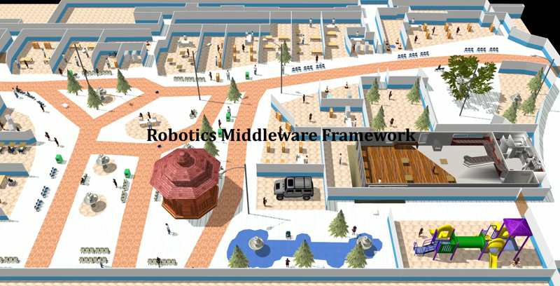
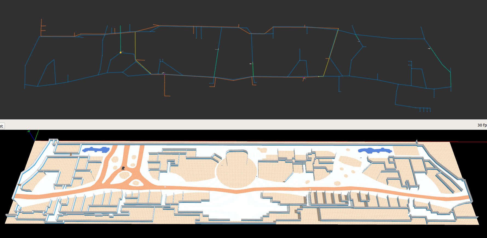
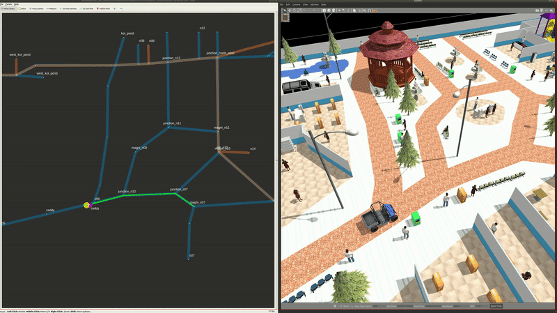
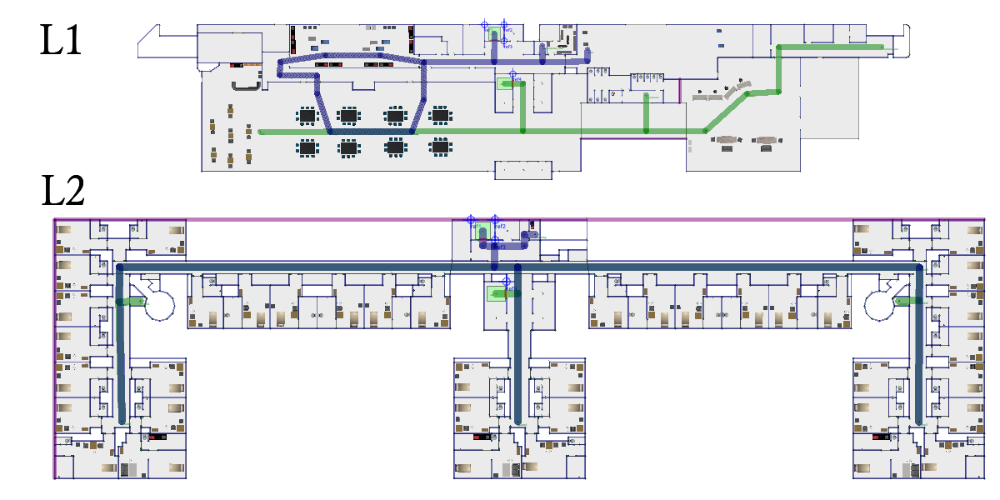
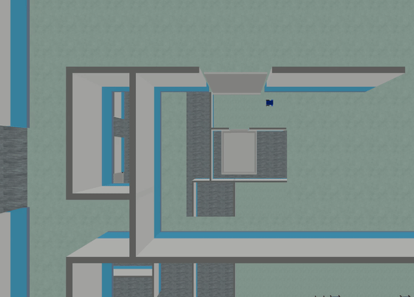

# RMF Demos


The Robotics Middleware Framework (RMF) enables interoperability among heterogeneous robot fleets while managing robot traffic that share resources such as space, building infrastructure systems (lifts, doors, etc) and other automation systems within the same facility. RMF also handles task allocation and conflict resolution  among its participants (de-conflicting traffic lanes and other resources). These capabilities are provided by various libraries in [rmf_core](https://github.com/osrf/rmf_core).

This repository contains demonstrations of the above mentioned capabilities of RMF. It serves as a starting point for working and integrating with RMF.

[](https://vimeo.com/405803151)

#### (Click to watch video)

## System Requirements

These demos were developed and tested on

* [Ubuntu 18.04 LTS](https://releases.ubuntu.com/18.04/)

* [ROS 2 - Eloquent](https://index.ros.org/doc/ros2/Releases/Release-Eloquent-Elusor/)

* [Gazebo 9.12.0 or 9.13.0](https://osrf-distributions.s3.us-east-1.amazonaws.com/gazebo/releases/gazebo-9.12.0.tar.bz2)

## Setup

Setup your computer to accept Gazebo packages from packages.osrfoundation.org.

```bash
sudo apt update
sudo apt install -y wget
echo "deb http://packages.osrfoundation.org/gazebo/ubuntu-stable bionic main" > /etc/apt/sources.list.d/gazebo-stable.list
wget https://packages.osrfoundation.org/gazebo.key -O - | apt-key add -
```
Install all non-ROS dependencies of RMF packages,

```bash
sudo apt update && sudo apt install \
  git cmake python3-vcstool curl \
  qt5-default \
  libboost-system-dev libboost-date-time-dev libboost-regex-dev libboost-random-dev \
  python3-shapely python3-yaml python3-requests \
  libignition-common3-dev libignition-plugin-dev \
  g++-8 \
  -y
```

Setup a new ROS 2 workspace and pull in the demo repositories using `vcs`,

```bash
mkdir -p ~/rmf_demos_ws/src
cd ~/rmf_demos_ws
wget https://raw.githubusercontent.com/osrf/rmf_demos/master/rmf_demos.repos
vcs import src < rmf_demos.repos
```

Ensure all ROS 2 prerequisites are fulfilled,

```bash
cd ~/rmf_demos_ws
rosdep install --from-paths src --ignore-src --rosdistro eloquent -yr
```

The models required for each of the demo worlds will be automatically downloaded into `~/.gazebo/models` from Ignition [Fuel](https://app.ignitionrobotics.org/fuel) when building the package `rmf_demo_maps`. If you notice something wrong with the models in the simulation, your `~/.gazebo/models` path might contain deprecated models not from `Fuel`. An easy way to solve this is to remove all models except for `sun` and `ground_plane` from `~/.gazebo/models`, and perform a clean rebuild of the package `rmf_demo_maps`.

## Compiling Instructions

Source ROS 2 Eloquent and build,

```bash
cd ~/rmf_demos_ws
source /opt/ros/eloquent/setup.bash
CXX=g++-8 colcon build --cmake-args -DCMAKE_BUILD_TYPE=RELEASE
```
> Note: The build will fail if the compiler is not set to g++ version 8 or above.
## FAQ
Answers to frequently asked questions can be found [here](docs/faq.md).

# Office World
An indoor office environment for robots to navigate around. It includes a beverage dispensing station, controllable doors and laneways which are integrated into RMF.


```bash
source ~/rmf_demos_ws/install/setup.bash
ros2 launch demos office.launch.xml
```

To simulate a delivery

Select `pantry` and `hardware_2` as `Start` and `End` waypoints. Ensure `Pickup` and `Dropoff` dispensers are set to `coke_dispenser` and `coke_ingestor` respectively. Finally, click the `Send Delivery Request` button in the RViz `RMF Panel`.

Alternatively, a launch file is configured to achieve the same result.

```bash
source ~/rmf_demos_ws/install/setup.bash
ros2 launch demos office_delivery.launch.xml 
``` 


To request each of the TinyRobot to loop between two points,
Select desired `Start` and `End` waypoints using the `RMF Panel` and click the `Send Loop Request` button. Alternatively,

```bash
source ~/rmf_demos_ws/install/setup.bash
ros2 launch demos office_loop.launch.xml
``` 


# Airport Terminal World

This demo world shows robot interaction on a much larger map, with a lot more lanes, destinations, robots and possible interactions between robots from different fleets, robots and infrastructure, as well as robots and users. In the illustrations below, from top to bottom we have how the world looks like in `traffic_editor`, the schedule visualizer in `rviz`, and the full simulation in `gazebo`,




## Demo Scenario
To launch the world and the schedule visualizer,

```bash
source ~/rmf_demos_ws/install/setup.bash
ros2 launch demos airport_terminal.launch.xml
```

To spawn robots into the world and issue tasks to the same,

```bash
source ~/rmf_demos_ws/install/setup.bash
ros2 run demos airport_terminal_scenario.sh
```
This command spawns two DeliveryRobots and four TinyRobots in the map. Out of these one DeliveryRobot and two TinyRobots are issued loop request tasks. The other robots are idle and can be issued loop or delivery request tasks via the `RMF Panel`.

Alternatively, to spawn all the robots without issuing any task orders,

```bash
source ~/rmf_demos_ws/install/setup.bash
ros2 run demos airport_terminal_spawn_robots.sh
```

An delivery request may also be submitted via a launch file,
```bash
source ~/rmf_demos_ws/install/setup.bash
ros2 launch demos airport_terminal_delivery.launch.xml
```

Non-autonomous vehicles can also be integrated with RMF provided their positions can be localized in the world. This may be of value at facilities where space is shared by autonomous robots as well as manually operated vechiles such as forklifts or transporters. In this demo, we can introduce a vehicle (caddy) which can be driven around through keyboard/joystick teleop. In RMF nomenclature, this vehicle is classified as a `read_only` type, ie, RMF can only infer its position in the world but does not have control over its motion. Here, the goal is to have other controllable robots avoid this vechile's path by replanning their routes if needed. The model is fitted with a plugin which generates a prediction of the vehicle's path based on its current heading. It is configured to occupy the same lanes as the `tinyRobot`s. Here, a `read_only_fleet_adapter` submits the prediction from the plugin to the RMF schedule.

To spawn the caddy into the world,

```bash
source ~/rmf_demos_ws/install/setup.bash
ros2 launch demos airport_terminal_caddy.launch.xml
```



# Imaginary Clinic World

This is an imaginary clinic building with three levels and two lifts. Three different robot fleets with different roles navigate across all three levels by lifts. In the illustrations below, we have the view of all three levels in `traffic_editor` (top left), the schedule visualizer in `rviz` (right), and the full simulation in `gazebo` (bottom left).


## Demo Scenario
To launch the world and the schedule visualizer,

```bash
source ~/rmf_demos_ws/install/setup.bash
ros2 launch demos imaginary_clinic.launch.xml
```

To simulate a delivery

Select fleet `tinyRobot`, set `L1_pantry` and `L3_ward4` as `Start` and `End` waypoints. Ensure `Pickup` and `Dropoff` dispensers are set to `coke_dispenser` and `coke_ingestor` respectively. Finally, click the `Send Delivery Request` button in the RViz `RMF Panel`.

Alternatively, a launch file is configured to achieve the same result.

```bash
source ~/rmf_demos_ws/install/setup.bash
ros2 launch demos clinic_delivery.launch.xml 
``` 

To request each of the robots to loop between two points, select desired robot fleet, `Start` and `End` waypoints using the `RMF Panel` and click the `Send Loop Request` button. Alternatively,

```bash
source ~/rmf_demos_ws/install/setup.bash
ros2 launch demos clinic_loop.launch.xml
``` 

Robots taking lift:


Multi-fleet demo:


# Hotel

This is a hotel with a lobby and a guest level. The hotel has two lifts and two robot fleets. The tiny robots are supposed to guide the guests and the delivery robots are used to load and deliver cargo



## Demo Scenario
To launch the world and the schedule visualizer,

```bash
source ~/rmf_demos_ws/install/setup.bash
ros2 launch demos hotel.launch.xml
```

To simulate a loop request, select desired robot fleet, `Start` and `End` waypoints using the `RMF Panel` and click the `Send Loop Request` button.

Robot taking lift:

